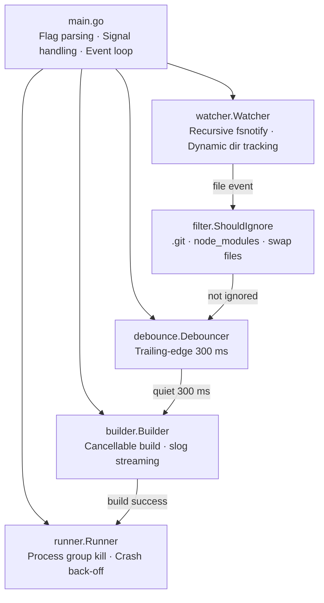
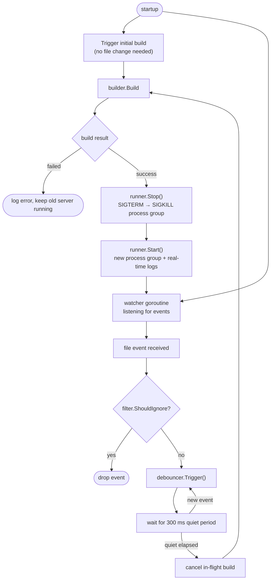

# Hotreload

A production-grade CLI tool that watches a project directory for file changes, automatically rebuilds the project, and restarts the server — handling real-world editor quirks, process cleanup, and crash loops.

```
hotreload --root ./myproject --build "go build -o ./bin/server ./cmd/server" --exec "./bin/server"
```

---

## Features

| Feature | Details |
|---|---|
| **File watching** | Recursive `fsnotify`-based watcher with dynamic directory tracking |
| **Debouncing** | Trailing-edge 300 ms debounce — no duplicate rebuilds from editor temp files |
| **Cancel in-flight builds** | New change while building? Previous build is cancelled immediately |
| **Process tree killing** | Uses `SIGKILL` on the entire process group (`Setpgid`), not just the parent PID |
| **Graceful stop** | `SIGTERM` first, escalates to `SIGKILL` after 2 s |
| **Crash loop protection** | Exponential back-off (500 ms → 30 s cap) if server exits within 1 s of start |
| **Real-time logs** | stdout/stderr piped directly — zero buffering |
| **Smart filtering** | Ignores `.git/`, `node_modules/`, `vendor/`, swap files, temp files |
| **Dynamic dirs** | New subdirectories created at runtime are added to watch list automatically |
| **OS limit awareness** | Logs a warning if > 500 directories are watched; documents `ulimit -n` fix |

---

## Quick Start

### Prerequisites

- Go 1.22+
- Linux or macOS

### Build

```bash
make build
# or
go build -o ./bin/hotreload .
```

### Run with the demo test server

```bash
make demo
```

Then in another terminal:

```bash
curl http://localhost:8080
# Hello from testserver! PID: 12345 | Version: v1.0.0 | ...
```

Now edit `testserver/main.go` — change the `version` string — and save. Within ~2 seconds you'll see the server restart and `curl` will return the updated version.

---

## CLI Usage

```
hotreload --root <project-folder> --build "<build-command>" --exec "<run-command>"
```

| Flag | Description |
|---|---|
| `--root` | Directory to watch for file changes (including all subdirectories) |
| `--build` | Shell command to build the project (e.g. `go build -o ./bin/server .`) |
| `--exec` | Shell command to run the built server (e.g. `./bin/server`) |

### Examples

**Single Go project:**
```bash
hotreload --root . --build "go build -o ./bin/api ." --exec "./bin/api"
```

**Multi-package project:**
```bash
hotreload \
  --root ./myapp \
  --build "go build -o ./bin/server ./cmd/server" \
  --exec "./bin/server --port 8080"
```

---

## Architecture



### Flow



### Key Design Decisions

**Why process groups?**  
`cmd.SysProcAttr = &syscall.SysProcAttr{Setpgid: true}` puts the server and all its children in a new process group. `syscall.Kill(-pgid, syscall.SIGKILL)` then kills every process in the group — no zombies, no lingering port leases.

**Why trailing-edge debounce?**  
Editors like Vim and JetBrains trigger 3–5 file events per save (write temp, rename, chmod). If we rebuilt on the first event, we'd rebuild against a partially-written file. Trailing-edge debounce waits for the flurry to settle.

**Why cancel in-flight builds?**  
If the developer saves rapidly, we don't want N builds queued up. The `Builder` holds a `context.CancelFunc` for the running build; each new request cancels the previous one so only the latest code state is ever built.

**Crash loop protection:**  
If the server exits within 1 second of starting (bad binary, port already in use), we apply exponential back-off (500 ms, 1 s, 2 s … capped at 30 s) to avoid a CPU-spining restart loop.

---

## Project Structure

```
hotreload/
├── main.go                  # Entry point, flag parsing, event loop
├── watcher/
│   ├── watcher.go           # Recursive fsnotify watcher
│   └── watcher_test.go
├── builder/
│   ├── builder.go           # Build command runner with cancellation
│   └── builder_test.go
├── runner/
│   ├── runner.go            # Process lifecycle + crash loop protection
│   └── runner_test.go
├── debounce/
│   ├── debounce.go          # Trailing-edge debouncer
│   └── debounce_test.go
├── filter/
│   ├── filter.go            # ShouldIgnore logic
│   └── filter_test.go
├── testserver/
│   ├── main.go              # Demo HTTP server
│   └── go.mod
├── go.mod
├── go.sum
├── Makefile
└── README.md
```

---

## Running Tests

```bash
make test
# or
go test -v -race ./...
```

Tests cover: `filter`, `debounce`, `builder`, `runner`, `watcher`.

---

## OS File Descriptor Limits

On Linux, each watched directory consumes an inotify watch descriptor. The default limit is typically 8192. For very large projects:

```bash
# Temporary (current session)
ulimit -n 65536

# Permanent (add to /etc/sysctl.conf)
fs.inotify.max_user_watches=524288
```

`hotreload` will log a warning if directory count exceeds 500.

---

## Ignored Paths

By default, `hotreload` ignores changes to:

- **Directories:** `.git/`, `node_modules/`, `vendor/`, `.idea/`, `.vscode/`
- **Editor temp files:** `*~`, `*.swp`, `#*#`, `.#*`
- **Temp/build artifacts:** `*.tmp`, `*.test`, `*.o`, `*.a`, `*.so`
- **OS metadata:** `.DS_Store`, `Thumbs.db`

---

## License

MIT
